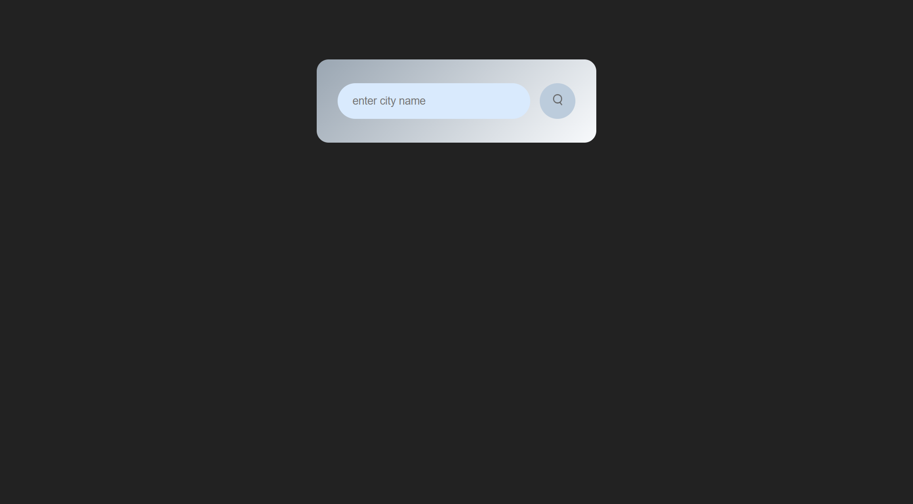
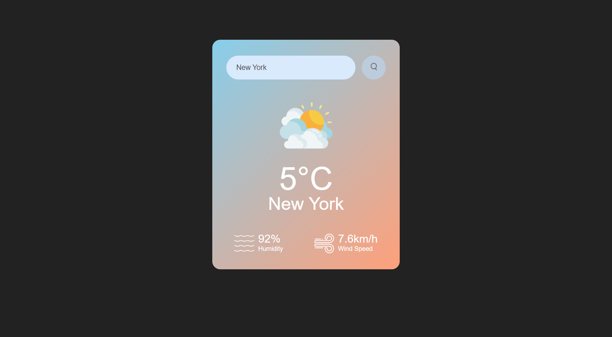

# Weather-forecast-web-app

This project is a simple weather application that fetches real-time weather data from the OpenWeather API and displays it in an interactive user interface. Users can input a city name to retrieve information such as temperature, humidity, wind speed, and a weather icon corresponding to the current weather condition.

---

## Features

- **Real-Time Weather Data:** Fetches live weather updates for any city using the OpenWeather API.
- **Dynamic Weather Icons:** Displays icons based on the current weather (e.g., clouds, rain, clear, etc.).
- **Responsive Design:** Optimized for different screen sizes, including mobile and desktop.
- **Error Handling:** Displays an error message for invalid city names.

---

## Technologies Used

- **HTML** for structuring the web page.
- **CSS** for styling and creating responsive layouts.
- **JavaScript** for making API calls and adding dynamic functionality.
- **OpenWeather API** for fetching weather data.

---

## Installation

1. Clone the repository:

   ```bash
   git clone https://github.com/your-username/Weather-forecast-web-app.git
   ```

2. Navigate to the project directory:

   ```bash
   cd Weather-forecast-web-app
   ```

3. Open the `index.html` file in your preferred web browser:

   ```bash
   open index.html
   ```

---

## File Structure

```
Weather-forecast-web-app/
├── index.html              # HTML structure
├── style.css               # CSS for styling
├── script.js               # JavaScript for functionality
├── README.md               
├── assests/                # Images and icons
│   ├── clear.png           
│   ├── clouds.png         
│   ├── drizzle.png         
│   ├── humidity.png        
│   ├── mist.png            
│   ├── rain.png           
│   ├── search.png          
│   ├── snow.png           
│   └── wind.png           
└── screenshots/           
    ├── weather-search-ui.png       
    └── weather-result-display.png 

```

---

## Usage

1. Open the app in your browser.
2. Enter a city name in the search bar.
3. Click the search button to fetch weather data.
4. The app will display:
   - Current temperature
   - Humidity percentage
   - Wind speed
   - An icon representing the weather
5. The background gradient will change dynamically based on the time of the day (day or night).

---

## API Configuration

To use this app, ensure you have a valid OpenWeather API key. Replace the placeholder `apikey` in the `script.js` file with your API key:

```javascript
const apikey = "your-api-key-here";
```

You can get an API key by signing up at [OpenWeather](https://openweathermap.org/api).

---

## Screenshots

### Search Interface:



### Weather Result Display:



---

## Future Improvements

- Add support for multiple languages.
- Display additional weather details (e.g., air quality, pressure).
- Implement geolocation to fetch weather data for the user's current location.
- Add a forecast feature for upcoming days.

---

## Contributing

Contributions are welcome! If you have suggestions or bug fixes, feel free to open an issue or submit a pull request.

---

## Acknowledgments

- [OpenWeather API](https://openweathermap.org/api) for providing weather data.
- [Poppins Font](https://fonts.google.com/specimen/Poppins) for typography.

---

## License

This project is licensed under the MIT License. See the [LICENSE](LICENSE) file for details.

---

**Enjoy using the Weather App!**

